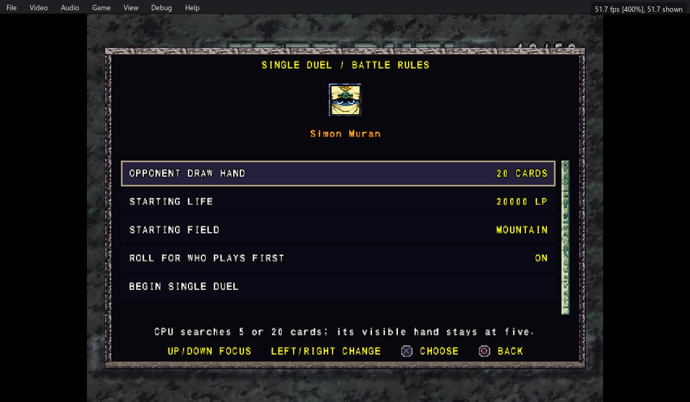

# Forbidden Memories — DeepDream Community Duel Mods

Customize Free Duels, play two against two, and bring character portraits into
battle. Four optional mods by **deepdream and Codex**, built on
[Unchiga's Forbidden Memories Recompiled](https://github.com/Unchiga/Yu-Gi-Oh-Forbidden-Memories-Recompiled).

**[Download Beta 5 for Windows](https://github.com/DreamWatching/Yu-Gi-Oh-Forbidden-Memories-Recompiled-DeepDream/releases/download/community-duel-mods-beta5/community-duel-mods-beta5-windows-preview2.zip)**
 · [Release notes and other downloads](https://github.com/DreamWatching/Yu-Gi-Oh-Forbidden-Memories-Recompiled-DeepDream/releases/tag/community-duel-mods-beta5)
 · [Every mod and option](notes/community-duel-mods/MOD_GUIDE.md)

This is a **community beta** for the supplied Windows companion build, based on
**v0.1.4-preview.2**. Bring your own USA **SLUS-01411** disc image; game data and
personal saves are not included. It is not an official upstream release.

## A look inside



*The single-duel rules screen uses the game's font, portraits, stone borders and
scrollbar. Tag Duels adds partner and rival selection to the same Free Duel flow.*

## What's included

| Mod | What it adds |
|---|---|
| **Duel Options** | Starting LP from 4,000 to 20,000; selected or random terrain; recurring animated field changes; 5/20-card CPU search; Guardian Star Face-off to choose who starts; named deck recipes. |
| **Tag Duels** | Two teams sharing LP and a field, with four private decks and hands. Choose a CPU or human partner, temporarily edit their signature deck, and use team-scaled ranking. **Tag Rewards** is an included, default-on setting. |
| **Duel Portraits** | Active/waiting portrait panels with names, control labels and hand/deck counts, for campaign, Free Duel, two-player and tag battles. |
| **NEW Card Markers** | Mark every genuinely new reward card during the current session, beyond the original recent-card list. Duplicate rewards do not get a new badge. |

Enable each mod independently in **Game > Mods**. **Tag Duels requires Duel
Options**; Portraits and NEW Card Markers are optional. Opponent Draw Hand
changes how many cards the CPU searches, **not** its five visible hand slots.

## Start playing

1. Download the **Windows** ZIP linked above. It contains the companion executable
   and all four mods; you do not need the individual mod ZIPs.
2. Extract it into a **new folder**, run `memories-pc.exe`, and select your USA disc image.
3. Open **Game > Mods** (press **F10** if the menu bar is hidden). Enable **Duel
   Options** and the other mods you want. Tag Rewards is under **Tag Duels > Settings**.
4. Load a normal campaign save and select **Free Duel**. Choose an opponent for
   single-duel rules, or use the **Triangle** duel-type prompt when Tag Duels is enabled.

Back up your saves before moving them between installations. Keep PC save states
with their original build. Individual mod ZIPs require this companion host;
installing them on a stock executable is not supported by this beta.

## Guides and development

- [Complete features, rules, controls and compatibility](notes/community-duel-mods/MOD_GUIDE.md)
- [Build from source](notes/community-duel-mods/BUILD.md)
- [Maintainer review: files changed, tests and limitations](notes/community-duel-mods/MAINTAINER_REVIEW.md)
- [Integration proposal for Unchiga](https://github.com/Unchiga/Yu-Gi-Oh-Forbidden-Memories-Recompiled/issues/234)
- [Report a bug](https://github.com/DreamWatching/Yu-Gi-Oh-Forbidden-Memories-Recompiled-DeepDream/issues)

The 15 community logic suites and the Windows/Linux foundation and sanitizer
checks pass. Linux **gameplay**, physical controllers, every GPU/HD combination
and future upstream versions still need broader acceptance testing. This beta
is not a promise of 200 displayed FPS at 400% speed.

For code changes, use **community-duel-mods-beta5-source.zip** from the
[release](https://github.com/DreamWatching/Yu-Gi-Oh-Forbidden-Memories-Recompiled-DeepDream/releases/tag/community-duel-mods-beta5) or clone this **community-duel-mods-beta5** branch. The
source includes the corrected foundation test fixtures. Source-only review and
test changes do not replace the previously playtested Windows game binaries.

Original project and MIT notices are retained. Game content belongs to its
respective owners. The upstream README below describes the original project;
use the community download and guides above for these mods.

<details>
<summary><strong>Original Forbidden Memories Recompiled README</strong></summary>

# Yu-Gi-Oh! Forbidden Memories Recompiled

**Yu-Gi-Oh! Forbidden Memories** (PS1, USA) rebuilt from its decompiled source as a
native PC game for Windows and Linux. Bring your own disc image; no game data is
included but the text of the European translations (below).


## Features

- Up to 4x internal resolution, widescreen and HD text
- **3D Monsters**: face-up monsters stand on the field as their battle models
- Optional **Forbidden Memories HD** pack: redrawn cards, frames and portraits
- Mods: framework for new cards past the original 722, fusions, textures, music, gameplay tables
- Save slots, fusion helper, card drop rates, rebindable controls
- **Game > Language**: the European releases' own English, French, German, Italian and Spanish


## Play

Download the latest build from [Releases](https://github.com/Unchiga/Yu-Gi-Oh-Forbidden-Memories-Recompiled/releases),
extract it and run `memories-pc.exe` (Windows) or `./memories-pc` (Linux). On first
launch, pick your USA disc's `.bin`. The game can tell you when a newer release is out
(**Help > Check for updates at start** turns it off; see [Updates](notes/updates.md)).

### HD pack

1. From the same release, download `yfm-redecomp-hd-mod-<version>.zip`.
2. Close the game and extract the zip into the game folder, the one with `memories-pc.exe`
   or `memories-pc`. You should end up with `mods/assets-hd` beside the other mods.
3. Start the game. The pack is on by default: press **F10** for the menu bar and open
   **Game > Mods** to check it, or to turn it or any of its parts off.
4. For the best look, pick **Video > Resolution > Internal 4x** and turn on **Video > HD text**.

**From source:** put the `.bin` in `game/` and run `play.bat` or `./play.sh`. The first
run builds everything (Linux needs `gcc` and `python3`). See [PC build](notes/pc-build.md).

**Languages:** `languages/*.txt` is the text of the five European releases, read off the
PAL discs by the port itself. With the discs in `game/pal`, `python3 tools/pc/export_languages.py`
writes them again, and `--check` compares them ([Translations](notes/translation.md),
"The official languages"). They are the only game data in the repository: text, no pictures.

## Decompilation

Every game function matches the original executable byte for byte:

```sh
make tools   # pinned toolchain
make match   # rebuild SLUS_014.11 exactly (see notes/setup.md)
```

<details>
<summary>Progress</summary>

<!-- BEGIN GENERATED PROGRESS -->

| Metric | Current |
|---|---:|
| Game C-decompilation targets matched | **1,134 / 1,134 (100.00%)** |
| Game C-decompilation target bytes matched | **356,080 (`0x56EF0`) / 356,080 (`0x56EF0`) (100.00%)** |
| Remaining game C-decompilation targets | 0 functions, 0 (`0x0`) |
| Evidence-backed handwritten game assembly | 61 functions, 40,116 (`0x9CB4`) |
| Total game-owned functions | 1,195 |
| Preserved Psy-Q CRT/SDK assembly | 591 functions, 117,348 (`0x1CA64`) |
| Total discovered functions | 1,786 |
| Embedded/unassigned resident text | 1,780 (`0x6F4`) |

Runtime overlay modules:

| Module | Matching C functions | Matching C bytes |
|---|---:|---:|
| `free_duel` | 9 / 9 (100.00%) | 4,140 (`0x102C`) / 4,140 (`0x102C`) (100.00%) |
| `main_menu` | 31 / 31 (100.00%) | 17,724 (`0x453C`) / 17,724 (`0x453C`) (100.00%) |
| `overworld_after_coup` | 15 / 15 (100.00%) | 6,184 (`0x1828`) / 6,184 (`0x1828`) (100.00%) |
| `overworld_before_coup` | 15 / 15 (100.00%) | 6,184 (`0x1828`) / 6,184 (`0x1828`) (100.00%) |
| `password` | 27 / 27 (100.00%) | 10,884 (`0x2A84`) / 10,884 (`0x2A84`) (100.00%) |

_Generated from `config/slus_01411/functions.csv` and `config/slus_01411/overlays/*_functions.csv` by `tools/project/progress.py`._

<!-- END GENERATED PROGRESS -->

</details>

## Docs

[Modding](notes/modding.md) · [More cards](notes/more-cards.md) · [Fusion helper](notes/fusion-helper.md) ·
[Card drops](notes/card-drops.md) · [Translations](notes/translation.md) · [Updates](notes/updates.md) · [Setup](notes/setup.md) · [Build](notes/build.md) ·
[Releases](notes/pc-release.md)

## Community

Join the [Discord](https://discord.gg/Gn6Mag52q) to follow development, ask questions
and report issues.

## License

The PC port (`src/pc/`, `tools/pc/`, `tests/pc/`, `mods/`, `examples/` and the build
and play scripts) is [MIT](LICENSE): keep the copyright notice and please link back
here. The decompilation builds on [memories-decomp](https://github.com/krystalgamer/memories-decomp)
by its authors. Yu-Gi-Oh! and Forbidden Memories belong to Konami.

</details>
